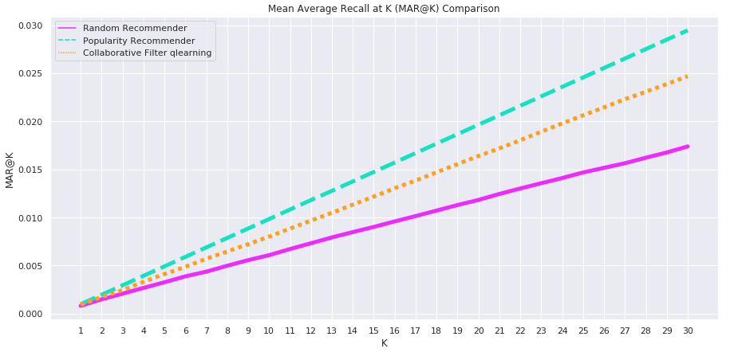
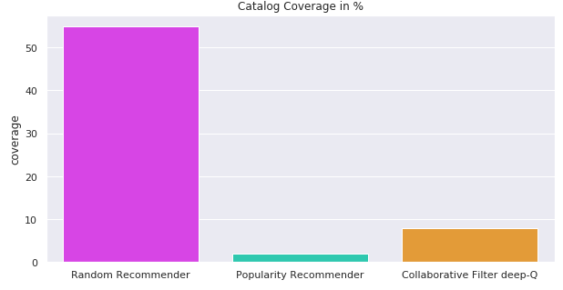

# Deep Reinforcement Learning Algorithms for Store Item Recommendation

Here are the codes of few reinforcement learning approaches that used to train the network to predict the hot sales item of a grocery shop.
These works are general warming up before drive into details on every each algorithms. Next coming works will be specifically focus on each of these algorithms and provide some project tutorials and explanation.

## The deep reinforcement learning algorithms that covered in this work as following:
1. Feedforward Neural Network
2. Convolutional Neural Network (CNN)
3. Deep Q-learning (DQN)
4. Recurrent Neural Network (RNN)
5. Double Deep Q-learning
6. Double Recurrent Deep Q-learning

Some comparison of the performance of each algorithms against baseline method were performed.

And also the coverage. In this case, random coverage is much more highest. However, it does not indicate the quality of the algorithms. In this study, the results is not being emphasize since this work is aimed to get familiar with the machine learning approaches and apply in recommendation system.

# Dependencies
<ul>
  <li>TensorFlow</li>
  <li>Numpy</li>
  <li>Matplotlib</li>
  <li>Pandas</li>
  <li>Seaborn</li>
  <li>Scikit-Learn</li>
</ul>

